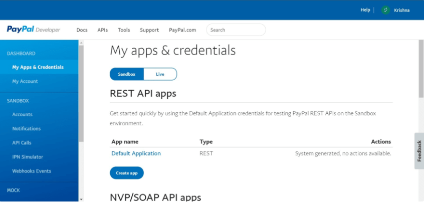

# React_PayPal_payment (Paypal Payment)

The intent of this application is to build a service which require the user to get payment from the customers. This application is best to use in an e-commerce site. For this purpose a dependable payment gateway is the goal. Using React with an integration of PayPal Checkout system is best solution.

## Creating PayPal Sandbox Account

The first step is to go to the PayPal Developer Dashboard create a PayPal account and login with it. By default you'll be redirected to the My apps & Credentials section in Sandbox Mode.



Now create two sandbox accounts for testing purposes and mimicking live transactions by going to the Accounts tab in the Sandbox section. You'll find two sandbox accounts generated by default in the Sandbox Accounts Section.


Create two more for this application. One would be a Business Account that will accept payments while the other one would be Personal Account through which you'll be making the payments. 

To create them simply click on

1. Create account
2. Select the type of account
3. Select your Country/Region
4. Click on Create

By default the accounts will be created with terrible looking details. You can Edit them by clicking on the button in the Manage Accounts column.

You now have two PayPal Sandbox Accounts to mimic a transaction. But wait, you'll also need a PayPal app to successfully accept a payment.


## Creating PayPal App

Go back to the My apps & Credentials section. Under the REST API apps you can see one app generated by default. We'll create one for ourselves. To do this simply

1. Click on the Create app button
2. Give a name to your app, I have named it React-Test
3. Link it to the Sandbox Business Account you just created
4. Click on Create

You'll now get access to the credentials of your app including the Client ID and Secret.


Copy them somewhere, we'll be needing them once we get back to coding our react app.

Before moving any further let us login with our Business Sandbox Account in the PayPal Sandbox Dashboard to check the Business Account Dashboard which would look like this.


## Integrating Smart Payment Buttons

Before writing any code for our component we need to integrate the PayPal Smart Payment Button with our application. To do that go to the /public/index.html and paste the following code in the HEAD tag.

```bash

<script src="https://www.paypal.com/sdk/js?client-id=YOUR_CLIENT_ID&currency=USD"></script>

```
The Client ID is the same that you got on registering your app with PayPal in the above section. Don't forget to place the &currency=YOUR_CURRENCY after your client ID because it wouldn't work properly without it.

Now you can run the above repo to test your application.

